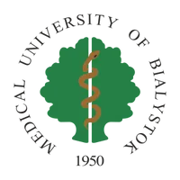
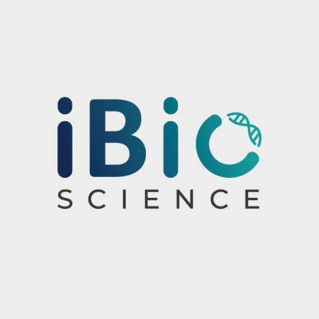
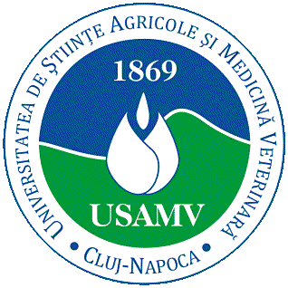
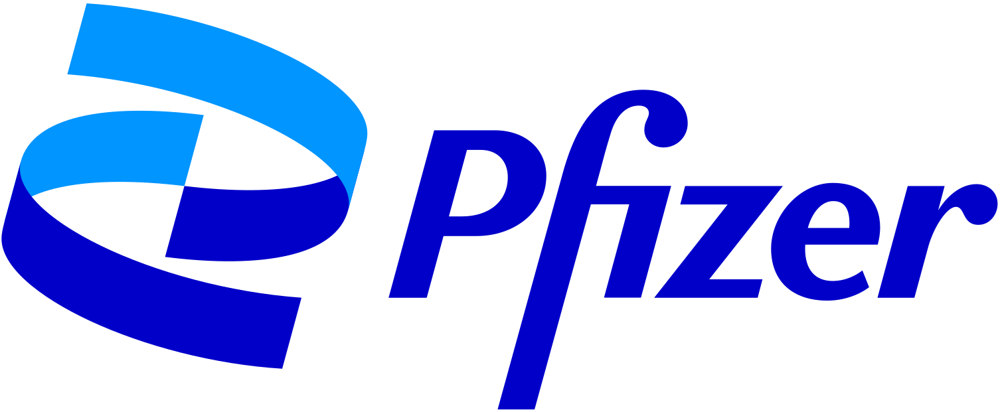
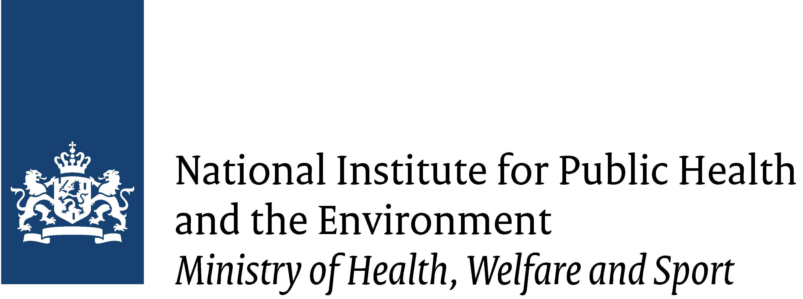
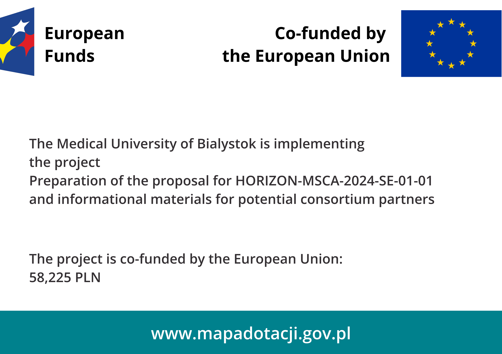

::: hero-image
:::

<body class="index-page">

::: text-box
<h1>OneTick</h1>

<p>OneTick aims to enhance our understanding and management of tick-borne diseases in urban and peri-urban environments by integrating ecological, biomedical, and public health perspectives. We will address the interconnected health of humans, animals, and the environment by employing a One Health approach.<br>More information you can find also on [CORDIS](https://cordis.europa.eu/project/id/101236599) website </p>

<p>Tick-borne diseases (TBDs), caused by bacteria, viruses, or protozoa, present a significant health and socioeconomic challenge in Europe. Historically centered in Central and Eastern Europe, Lyme disease and tick-borne encephalitis (TBE) are prevalent in Austria, Germany, and the Czech Republic, with their range expanding due to climate change.</p>

<p>OneTick, under the One Health framework, aims to enhance the prevention, detection, and treatment of tick-borne diseases in urban areas. Work Package 1 investigates urban tick adaptation, assessing their abundance, species diversity, and pathogens. Work Package 2 examines tick-host-pathogen interactions to develop predictive models for disease spread. Work Package 3 aims to enhance diagnostics through the identification of disease biomarkers and the development of predictive models for survival rates. Lastly, Work Package 4 focuses on raising public health awareness through guidelines and educational campaigns to combat misinformation.</p>

<p>In OneTick each participating organization contributes unique expertise, forming a radial structure that integrates diverse scientific perspectives and fosters harmonization of methodologies across disciplines and sectors. We plan to implement 90 PM of secondments, incl. 60 intersectoral and 30 interdisciplinary staff exchanges. Through secondments, we will disseminate best practices, enhance interoperability, and establish shared frameworks for tick-borne disease research and surveillance.</p>
:::
:::

::: text-box
<h1>Institutes</h1>


<p> This project brings together experts from various institutes to achieve the best possible outcome. The following institutes are part of the collaboration. More information about each institute and their team leaders can be found [here](subsites/consortium.qmd).  

Click on an institution's logo to visit its website.
</p>

```{=html}
<!-- SPONSORS SECTION -->
<section id="sponsor-logos" class="sponsors">
  <a href="https://www.umb.edu.pl/en/" target="_blank" rel="noopener noreferrer" aria-label="Visit Medical University of Bialystok website">
    
  </a>
  <a href="https://www.rigshospitalet.dk/english/Pages/default.aspx" target="_blank" rel="noopener noreferrer" aria-label="Visit Rigshospitalet website">
    
  </a>
  <a href="https://www.fu-berlin.de/" target="_blank" rel="noopener noreferrer" aria-label="Visit Freie Universität Berlin website">
    
  </a>
  <a href="https://www.bc.cas.cz/" target="_blank" rel="noopener noreferrer" aria-label="Visit Biological Centre website">
    
  </a>
  <a target="_blank" rel="noopener noreferrer" aria-label="iBio Science">
    
  </a>
  <a href="https://www.usamvcluj.ro/" target="_blank" rel="noopener noreferrer" aria-label="Visit USAMV Cluj website">
    
  <a href="https://www.sshf.no/" target="_blank" rel="noopener noreferrer" aria-label="Visit Sørlandet Sykehus website">
    
  </a>
  <a href="https://www.rjl.se/lanssjukhusetryhov" target="_blank" rel="noopener noreferrer" aria-label="Visit Länssjukhuset Ryhov website">
    
  </a>
  <a href="https://www.riojasalud.es/" target="_blank" rel="noopener noreferrer" aria-label="Visit Rioja Salud website">
    
  </a>
  </a>
  <a href="https://www.sh.se/english/sodertorn-university" target="_blank" rel="noopener noreferrer" aria-label="Visit Södertörn University website">
    
  </a>
  </a>
  <a href="https://www.pfizer.at/" target="_blank" rel="noopener noreferrer" aria-label="Visit Pfizer website">
    
  </a>
  </a>
  <a href="https://www.rivm.nl/en" target="_blank" rel="noopener noreferrer" aria-label="Visit National Institute for Public Health and the Environment website">
    
  </a>
</section>

<style>
  /* General Styles */
  .sponsors {
    display: flex;
    justify-content: center;
    align-items: center;
    flex-wrap: wrap;
    gap: 15px; /* Space between sponsor images */
  }

  .sponsors img {
    height: 100px;
    transition: transform 0.3s ease; /* Smooth hover effect */
  }

  .sponsors a:hover img {
    transform: scale(1.05); /* Slight zoom-in on hover */
  }

  /* Media Query for smaller screens */
  @media (max-width: 600px) {
    .sponsors {
      justify-content: center;
      align-items: flex-start;
      gap: 10px;
    }
  }
  
  @media (max-width: 600px) {
  .sponsors img {
    height: auto;  /* Erhält das Seitenverhältnis */
    max-width: 80px; /* Begrenzt die Breite der Logos für kleine Bildschirme */
  }
}

</style>

```
::: text-box
<h1>OneTick</h1>


<p>Funded by the European Union (project 101236599). Views and opinions expressed are however those of the author(s) only and do not necessarily reflect those of the European Union or the REA. Neither the European Union nor the granting authority can be held responsible for them.</p>
:::
::: text-box
<div style="font-size: 0.8em; line-height: 1.4;">



<h1 style="font-size: 1.1em;">Michał Burdukiewicz, Jarosław Chilimoniuk, and Anna Moniuszko-Malinowska receive
funding in the PARP Eurogrant Competition</h1>

<p>A project led by Dr. Michał Burdukiewicz and Dr. Jarosław Chilimoniuk from the
Bioinformatics and Multi-Omics Analysis Laboratory at the Clinical Research Centre, along
with Professor Anna Moniuszko-Malinowska from the Department of Infectious Diseases
and Neuroinfections at the Medical University of Białystok (MUB), has been selected for
funding by the Polish Agency for Enterprise Development (PARP) under the FENG 02.12
"Eurogrant Grants - Call for Research Projects."  
This funding supports projects with high innovative and research potential.  
The aim of this initiative by PARP is to enhance the innovation and international presence of
Polish research organizations by increasing their involvement in EU programs managed
centrally, particularly Horizon Europe.  
The project titled OneTick, submitted by Michał Burdukiewicz, Anna Moniuszko-Malinowska,
and Jarosław Chilimoniuk under the Marie Skłodowska-Curie Actions Staff Exchanges
programme, seeks to establish a consortium focused on developing new diagnostic methods
for tick-borne diseases. The innovation of the project lies in its adoption of the One Health
approach, which integrates human, animal, and environmental health.  
The funding awarded will help the team prepare their proposal for the Marie Skłodowska-
Curie Actions Staff Exchanges programme and create informational materials for potential
consortium partners. This will significantly increase their opportunities for international
research collaboration.  
The project is administratively supported by the Development and Evaluation Department at
MUB.
</p>

</div>
:::
