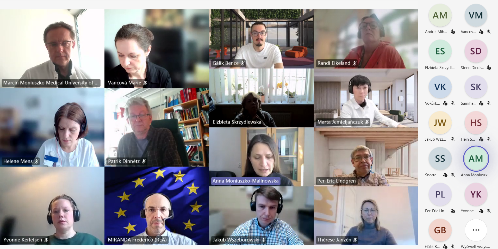

# 🕷️ OneTick officially kicks off! The **consortium** begins its journey 🤝

On **March 12, 2026**, the **Medical University of Białystok** hosted the **kick-off meeting of the OneTick project**, officially launching this 🇪🇺 **MSCA Staff Exchanges project** funded under the **Horizon Europe programme**.

The project is coordinated by **Prof. Anna Moniuszko-Malinowska** and brings together an international consortium to investigate **🕷️ tick-borne diseases** through a **🌍 One Health approach**, integrating human, animal, and environmental health perspectives.

## 💬 **A Strong Kick-Off Meeting**

The meeting was opened by the Rector of the Medical University of Białystok, **Prof. Marcin Moniuszko**, who highlighted the importance of **international scientific collaboration** and the role of European funding in advancing research.

During the meeting:  
- 📊 Project objectives and research goals were presented  
- 🧬 The concept of **TickPacket** — a unified data collection tool — was introduced  
- 🌐 Partners discussed **collaboration principles, timelines, and mobility plans**  
- 📑 Guidance on **MSCA Staff Exchanges implementation** was provided by the European Research Executive Agency  

A key presentation by **Dr. Michał Burdukiewicz** outlined the need for standardized patient data collection, covering clinical data, demographics, treatment responses, and complications — addressing current fragmentation across datasets.

## 🔬 **Research Focus**

The OneTick project will investigate:  
- 🌡️ The **impact of climate change** on tick distribution  
- 🏙️ Tick occurrence in **urban and suburban environments** (parks, gardens, playgrounds)  
- 📈 Improved **risk prediction and monitoring**  
- 🛡️ Development of **better prevention and control strategies**  

These interdisciplinary efforts aim to enhance understanding and management of tick-borne diseases across Europe.

## 🤝 **Consortium Collaboration**

The project is implemented by a consortium of **12 institutions from 10 European countries**, representing both academic and non-academic sectors.

The kick-off meeting enabled:  
- 🤝 Team integration and networking  
- 🔄 Exchange of knowledge and expertise  
- 🧭 Alignment on future collaboration and research directions  

Administrative support is provided by the **International Cooperation Department of the Medical University of Białystok**, ensuring effective coordination with international partners.

## 🚀 **Looking Ahead**

The launch of OneTick marks a significant step in strengthening the **internationalization** of the Medical University of Białystok and its role in the **European Research Area**.

Stay tuned for updates as the consortium begins its research activities and collaborative exchanges! 🌱🧬

---

Funded by the **European Union** (project **101236599**).  
Views and opinions expressed are however those of the author(s) only and do not necessarily reflect those of the **European Union** or the **REA**.  
Neither the European Union nor the granting authority can be held responsible for them.
