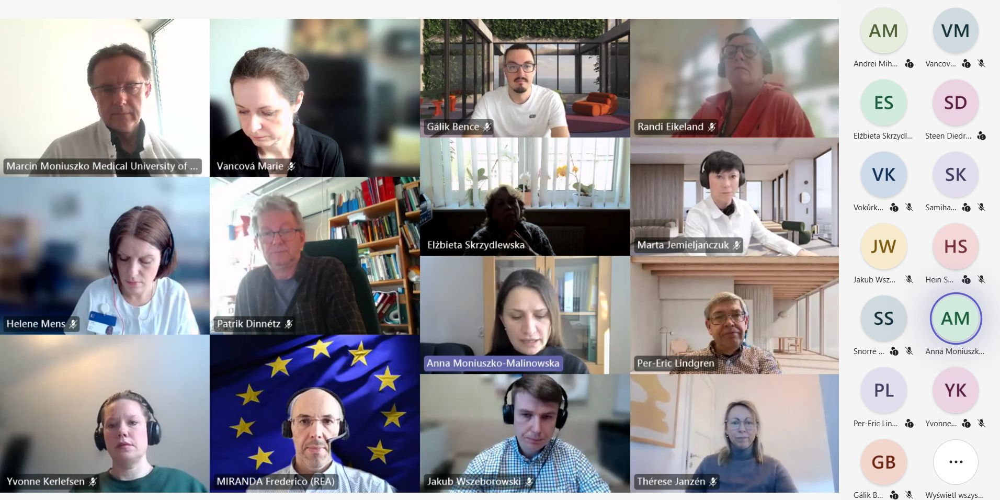

# 🚀 The OneTick project has officially begun!

On **12 March 2026**, the **OneTick project kick-off meeting** took place, officially launching this international research initiative coordinated by **Prof. Anna Moniuszko-Malinowska, PhD**, Vice-Dean for Science and Evaluation and Head of the Department of Infectious Diseases and Neuroinfections at the **Medical University of Białystok**. The event was attended by representatives of the partner institutions forming the project consortium and those involved in its implementation.

The meeting was opened by the Rector of the Medical University of Białystok, **Prof. Marcin Moniuszko**, who emphasised the importance of international scientific cooperation and the role of European projects in the development of research conducted at the university.

The event also featured presentations by representatives of the institutions involved in the project. A presentation on the programme and the rules for implementing projects under the **MSCA Staff Exchanges 2024** call was given by **Frederico Miranda**, Project Officer at the **European Research Executive Agency (REA)**.

**Dr Michał Burdukiewicz** from the Medical University of Białystok – the lead author of the grant application for the OneTick project – also gave a presentation.

The project is being carried out by an international consortium comprising **twelve institutions from ten European countries**, representing both the academic and non-academic sectors.

During the meeting, the project partners presented the main objectives and research goals, discussed the schedule of activities and the principles of cooperation within the framework of planned mobility and exchange of experiences between institutions. The kick-off meeting also provided an opportunity to bring the project team together and set out key areas of cooperation for the coming years of the project.

Administrative support for the project is provided by the **International Cooperation Department of the Medical University of Białystok**, which is responsible, among other things, for coordinating administrative activities related to the project’s implementation and for cooperation with international partners.

The implementation of the OneTick project represents an important step in the further internationalisation of the Medical University of Białystok and the strengthening of its position within the **European Research Area**.

We would like to thank all our partners for participating in the meeting and look forward to working together on the project in the coming years! 🤝🌍

---

Funded by the **European Union** (project **101236599**).  
Views and opinions expressed are however those of the author(s) only and do not necessarily reflect those of the **European Union** or the **REA**.  
Neither the European Union nor the granting authority can be held responsible for them.
